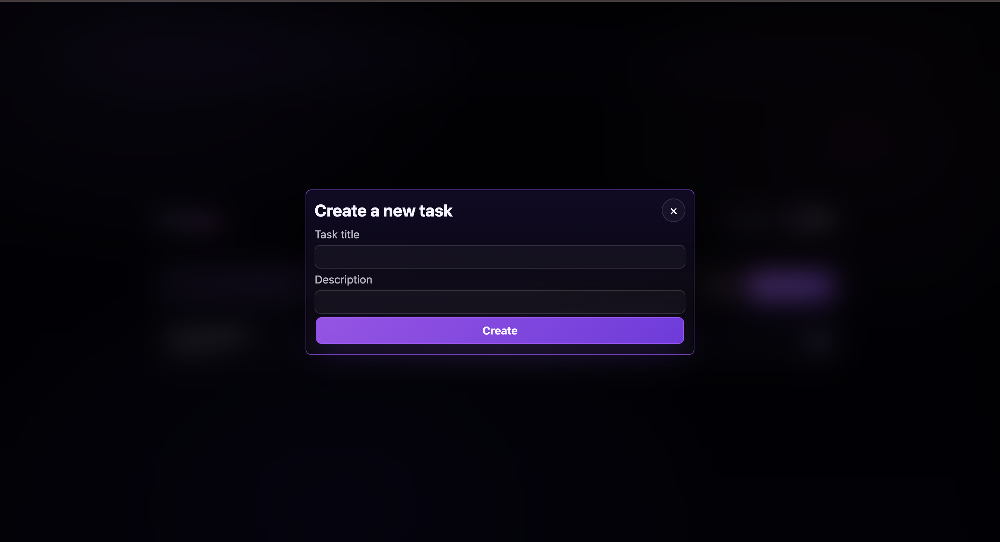

# 📝 Yappy – Smart Task Manager ⚡

> Organize your tasks. Stay focused. Get things done.

Yappy is a modern, lightweight task management web app built using JavaScript. It helps users create, manage, and track daily tasks with a clean and minimal interface.

---

## ✨ Features

- ✅ **Task Management**
  - Create new tasks with title & description  
  - Track tasks by date  
  - Mark tasks as completed  

- 📅 **Date-based Organization**
  - Tasks grouped by specific dates  
  - Easy navigation through daily tasks  

- 🔍 **Search Functionality**
  - Search tasks by date (multiple formats supported)  
  - Quickly find specific entries  

- 👤 **User Authentication UI**
  - Login & account creation system  
  - Clean and simple user flow  

- 💾 **Local Storage**
  - All tasks saved locally on your device  
  - No backend required  

---

## 🎯 Highlights

- ⚡ Fast and responsive  
- 🎨 Modern dark UI with neon accents  
- 🧠 Strong JavaScript logic implementation  
- 💻 Fully frontend-based project  

---

## 🖥️ Screenshots

### Landing Page


### Login System


### Dashboard


### Create Task



---

## 🛠️ Tech Stack

- **Frontend:** HTML, CSS, JavaScript  
- **Storage:** Local Storage  
- **Design:** Modern Dark UI  

---

## ⚙️ How to Run

```bash
# Clone repository
git clone https://github.com/Aakira14/yappy.git

# Open folder
cd yappy

# Run project
Open index.html in your browser
